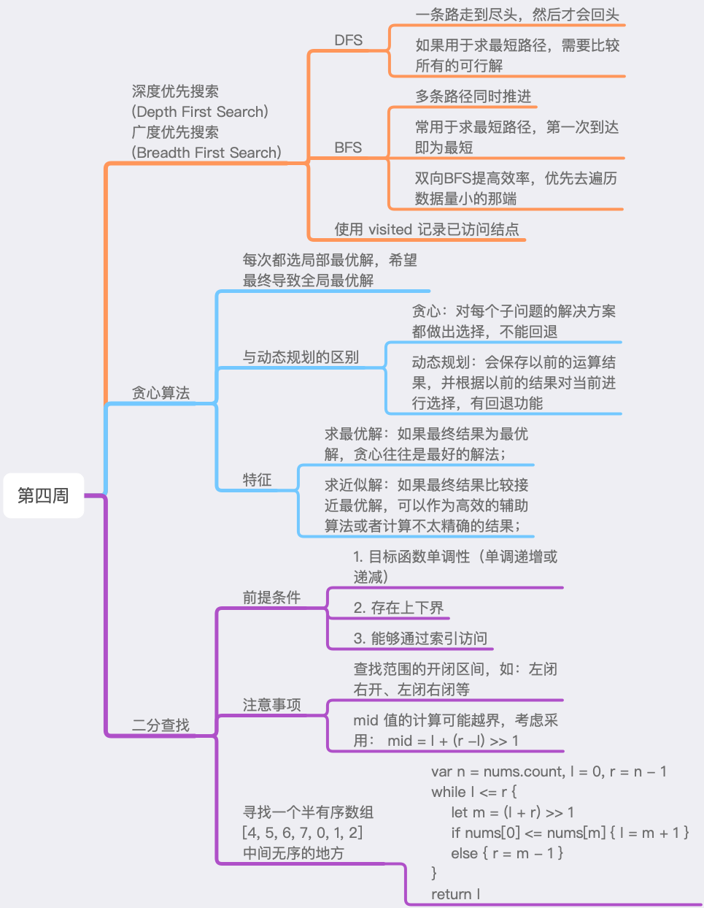

# 第四周总结




## 深度优先搜索、广度优先搜索的实现和特性

### 特性

#### DFS (Depth First Search)
选择一条路径之后，会一直走到尽头，然后才会选择其他路径。比如，从二叉树的树根一直走到叶子结点，然后才返回。

#### BFS (Breadth First Search)
同时选择多个路径，并同时推进。比如：二叉树的层级遍历，是从树根一层一层地往下走，最终走到叶子节点。

### 注意事项
- 切记，要使用 visited 集合记录已访问的结点，并且在终止条件中判定结点是否已访问。
- 在求最短路径时，BFS第一次到达时即为最短路径，而DFS需要遍历并比较所有的结果才能求出最短路径。


### 实现代码

#### DFS

递归写法：
``` c++
map<int, int> visited;
void dfs(Node* root) {
    if (!root) return ; // terminator
    if (visited.count(root->val)) {    // already visited
        return ;
    }
    visited[root->val] = 1;
    // process current node here.
    // ...
    for (int i = 0; i < root->children.size(); ++i) {
        dfs(root->children[i]);
    }
}
```

非递归写法：
``` c++
void dfs(Node* root) {
    map<int, int> visited;
    if(!root) return ;
    stack<Node*> stackNode;
    stackNode.push(root);
    while (!stackNode.empty()) {
        Node* node = stackNode.top();
        stackNode.pop();
        if (visited.count(node->val)) continue;
        visited[node->val] = 1;
        for (int i = node->children.size() - 1; i >= 0; --i) {
        		stackNode.push(node->children[i]);
        }
    }
}
```

#### BFS

``` c++
void bfs(Node* root) {
    map<int, int> visited;
    if(!root) return ;
    queue<Node*> queueNode;
    queueNode.push(root);
    while (!queueNode.empty()) {
        Node* node = queueNode.top();
        queueNode.pop();
        if (visited.count(node->val)) continue;
        visited[node->val] = 1;
        for (int i = 0; i < node->children.size(); ++i) {
            queueNode.push(node->children[i]);
        }
    }
}
```


## 贪心的实现、特性及实战题目解析

### 贪心算法
在每一步选择中都采取在当前状态下最好或最优的选择，从而希望导致结果是全局最好或最优的算法。

### 与动态规划的区别
- 贪心：对每个子问题的解决方案都做出选择，不能回退；
- 动态规划：会保存以前的运算结果，并根据以前的结果对当前进行选择，有回退功能；

简而言之，贪心就是**粗暴地**在**局部选择最优解**，最后全局也能得到最优解；而动态规划是局部的结果全部带走，之后再从这些结果中选择**全局最优解**。

### 特征
如果最终结果为最优解，贪心往往是最好的解法；
如果最终结果比较接近最优解，可以作为高效的辅助算法或者计算不太精确的结果；


## 二分查找的实现、特性及实战题目解析

### 前提条件
1. 目标函数单调性（单调递增或递减）
2. 存在上下界
3. 能够通过索引访问

### 代码模板
``` c++
// Time: O(logn), Space: O(1)
int binarySearch(const vector<int>& nums, int target) {
    int left = 0, right = (int)nums.size()-1;
    while (left <= right) {
        int mid = left + (right - left)/ 2;
        if (nums[mid] == target) return mid;
        else if (nums[mid] < target) left = mid + 1;
        else right = mid - 1;
    }
    return -1;
}
```


## 思考题

> 如何使用二分查找，寻找一个半有序数组 [4, 5, 6, 7, 0, 1, 2] 中间无序的地方？

核心思想：
用 mid 元素和第一个元素进行比较，确定有序的部分在左边还是右边。
如果 mid 元素大于等于第一个元素，说明 mid 仍然处于有序的部分，需要去右边找；
否则，mid 处于无序的部分，需要去左边找。

示例代码：
二分查找循环结束时，l 指向右边升序部分的开端，r 指向左边升序部分的末端。

``` swift
func findDisorder() {
    func f(_ nums: [Int]) -> Int {
        let n = nums.count
        var l = 0, r = n - 1
        while l <= r {
            let m = (l + r) >> 1
            if nums[0] <= nums[m] {
                l = m + 1
            } else {
                r = m - 1
            }
        }
        return l
    }
    assert(f([5,2,3,4]) == 1)
    assert(f([4,5,1,2,3]) == 2)
    assert(f([2,3,4,5,1]) == 4)
    assert(f([4,5,6,7,0,1,2]) == 4)
}
```


## 实战题目总结


- [最小基因变化](https://leetcode-cn.com/problems/minimum-genetic-mutation/#/description)

> 双向BFS解题思路：
> 构建3个集合，开始集合、结束集合、有效结果集合。
> 每次开始搜索时，检查开始集合是否为空，如果为空说明无解。
> 如果开始集合比结束集合要大，交换二者，这样可以优先遍历小集合，如果最终无解，可以尽快结束搜索。
> 搜索时，遍历开始集合中的所有元素，逐次尝试将每个元素的每个字符替换为A C G T。如果是相同的字符则跳过；
> 否则，检查替换后的字符串：如果结束集合包含了替换后的字符串，则得到最终答案；（因为BFS在搜索到第一个可行解时，这个可行解就一定是最优解）
> 否则，如果有效结果集合包含替换后的字符串，将该字符串加入到下一次的开始集合中，同时将该字符串从有效结果集合中移除，避免出现死循环。

``` swift
// Time: O(n * k * m), Space: O(n)
func minMutationWithBFS(_ start: String, _ end: String, _ bank: [String]) -> Int {
    if start == end { return 0 }
    if !bank.contains(end) { return -1 }
    let length = end.count, choices = ["A", "C", "G", "T"]
    var valid = Set<String>(bank)
    func bfs(start: Set<String>, end: Set<String>, mutations: Int) -> Int {
        if start.isEmpty { return -1 } // no valid result
        if start.count > end.count { // search from a smaller set for better performance
            return bfs(start: end, end: start, mutations: mutations)
        }
        var next = Set<String>()
        for s in start { // O(n)
            let startIndex = s.utf8.startIndex
            for index in 0..<length { // O(k)
                for choice in choices { // O(m)
                    let i = s.utf8.index(startIndex, offsetBy: index)
                    if s[i...i] == choice { continue } // skip same chars
                    var temp = s
                    temp.replaceSubrange(i...i, with: choice)
                    if end.contains(temp) { return mutations + 1} // find the result
                    if valid.contains(temp) {
                        valid.remove(temp) // avoid same paths
                        next.insert(temp)
                    }
                }
            }
        }
        return bfs(start: next, end: end, mutations: mutations + 1)
    }
    var s = Set<String>(), e = Set<String>()
    s.insert(start)
    e.insert(end)
    return bfs(start: s, end: e, mutations: 0)
}
```

> DFS解题思路：
> 如果开始字符串等于结束字符串，就将当前的修改次数与全局的修改次数进行比较，取最小值。（因为DFS需要在搜索完所有可行解之后，才知道哪一个是最优解）
> 否则，遍历有效结果集合中的字符串，逐个统计有效结果和开始字符串的字符差异数量，如果有效结果字符串和开始字符串的差异为1，而且该字符串不在已访问集合中，就将该字符串作为下一次搜索的开始字符串，然后将修改次数加1后传入下一次搜索。

``` swift
func minMutationWithDFS(_ start: String, _ end: String, _ bank: [String]) -> Int {
    if start == end { return 0 }
    if !bank.contains(end) { return -1 }
    var mutations: Int?, valid = Set(bank), visited = Set<String>()
    func dfs(s: String, e: String, m: Int) {
        if s == e {
            mutations = min(mutations ?? .max, m)
            return
        }
        for v in valid {
            var diff = 0
            for (a, b) in zip(v, s) {
                if a != b { diff += 1 }
                if diff > 1 { break }
            }
            if diff == 1, !visited.contains(v) {
                visited.insert(v)
                defer { visited.remove(v) }
                dfs(s: v, e: e, m: m + 1)
            }
        }
    }
    dfs(s: start, e: end, m: 0)
    return mutations ?? -1
}
```


- [x的平方根](https://leetcode-cn.com/problems/sqrtx/)

> 二分法

``` swift
// Time: O(logn), Space: O(1)
func binarySearch(_ x: Int) -> Int {
    var l = 0, r = x, ans = -1
    while l <= r {
        let mid = l + (r - l) >> 1
        if mid * mid <= x {
            ans = mid
            l = mid + 1
        } else {
            r = mid - 1
        }
    }
    return ans
}
```

> 牛顿迭代法

``` swift
// Time: O(logn), Space: O(1)
func newtonIteration(_ x: Int) -> Int {
    var r = x
    while r * r > x {
        r = (r + x/r) >> 1
    }
    return r
}
```


- [柠檬水找零](https://leetcode-cn.com/problems/lemonade-change/description/)

> 贪心法解题思路：
> 20 -> (10+5, 5+5+5) 的情况下，优先找面额大的钱，留下的小面额钱越多越好，只要有足够多的小面额的钱，就一定可以找零；

``` swift
//  Time: O(n), Space: O(1)
func lemonadeChange(_ bills: [Int]) -> Bool {
    var five = 0, ten = 0
    for bill in bills {
        switch bill {
        case 5: five += 1
        case 10: five -= 1; ten += 1
        case 20:
            // change bigger one first
            if ten > 0, five > 0 { ten -= 1; five -= 1 }
            else { five -= 3 }
        default: fatalError()
        }
        if five < 0 { return false }
    }
    return true
}
```


- [买卖股票的最佳时机 II](https://leetcode-cn.com/problems/best-time-to-buy-and-sell-stock-ii/)

> DP法解题思路：
> 状态分析：每天结束的时候，有2种状态：持有股票、不持有股票；
> 选择：买入、卖出、维持原样；
> 状态转移：1.当天不持有，从[之前就不持有]和[之前持有但是选择今天卖出]中选择最大值；2.当天持有，从[之前就持有]和[之前不持有但是选择今天买入]中选择最大值；
> 状态压缩：做出当天的选择时，需要依赖前一天持有和不持有的结果，所以可以将其他多余的状态进行压缩。

``` swift
// Time: O(n), Space: O(n)
func rawDp(_ prices: [Int]) -> Int {
    let n = prices.count
    var dp = [[Int]](repeating: [0, 0], count: n)
    dp[0][1] = -prices[0]
    for i in 1..<n {
        dp[i][0] = max(dp[i - 1][0], dp[i - 1][1] + prices[i])
        dp[i][1] = max(dp[i - 1][1], dp[i - 1][0] - prices[i])
    }
    return dp[n - 1][0]
}

// Time: O(n), Space: O(1)
func dp(_ prices: [Int]) -> Int {
    var noStock = 0, hasStock = -prices[0]
    for i in 1..<prices.count {
        (noStock, hasStock) = (
            max(noStock, hasStock + prices[i]),
            max(hasStock, noStock - prices[i])
        )
    }
    return noStock
}
```

> 贪心法解题思路：
> 只要能赚取差价，那就买入，到最后就是最大的收益；

``` swift
// Time: O(n), Space: O(1)
func greedy(_ prices: [Int]) -> Int {
    var sum = 0
    for i in 1..<prices.count {
        sum += max(0, prices[i] - prices[i - 1])
    }
    return sum
}
```


- [分发饼干](https://leetcode-cn.com/problems/assign-cookies/description/)

> 贪心法解题思路：
> 把贪婪因子和饼干大小数组按升序进行排序，然后从前向后遍历2个数组，饼干大小能满足贪婪因子时，计数器就加1。只要其中一个数组遍历结束就返回计数器的值。时间复杂度主要由排序构成。

``` swift
// Time: O(mlogm + nlogn), Space: O(1)
func sortAndGreedy(_ g: [Int], _ s: [Int]) -> Int {
    var g = g.sorted(), s = s.sorted(), i = 0, j = 0, ans = 0
    while i < g.count, j < s.count {
        if g[i] <= s[j] {
            i += 1
            j += 1
            ans += 1
            continue
        }
        j += 1
    }
    return ans
}
```


- [模拟行走机器人](https://leetcode-cn.com/problems/walking-robot-simulation/description/)

> 贪心法解题思路：
> 首先，需要注意 maximum Euclidean distance 这个关键点，否则最终结果就会出错！
> 然后，做好预处理：
> 1.定义各方向偏移量数组；
> 2.将障碍物存入集合，提高之后的检测效率；
> 3.记录x, y 以及移动方向 dir 和最终结果；
> 要点：遍历命令时，只在2移动结束后去更新结果，因为移动过程中不会变向，所以移动结束时才有可能达到【最大值】。

``` swift
func robotSim(_ commands: [Int], _ obstacles: [[Int]]) -> Int {
    let offset = [[0, 1], [1, 0], [0, -1], [-1, 0]]
    let stays = Set(obstacles)
    var ans = 0, dir = 0, x = 0, y = 0
    for command in commands {
        switch command {
        case -2: dir = (dir + 3) % 4
        case -1: dir = (dir + 1) % 4
        default:
            for _ in 0..<command {
                let _x = x + offset[dir][0]
                let _y = y + offset[dir][1]
                if stays.contains([_x, _y]) { break }
                (x, y) = (_x, _y)
                // avoid computing and comparing here
                // ans = max(ans, x * x + y * y)
            }
            ans = max(ans, x * x + y * y)
        }
    }
    return ans
}
```


- [岛屿数量](https://leetcode-cn.com/problems/number-of-islands/)

> DFS解题思路：
> 逐个遍历所有的网格元素，如果元素不为0，就采用DFS将相连的岛屿元素都置为0；
> 在遍历上下左右相邻的位置时，使用方向数组简化操作；

``` swift
// Time: O(m * n), Space: O(m * n)
func dfs(_ grid: [[Character]]) -> Int {
    let directions = [[-1, 0], [0, 1], [1, 0], [0, -1]]
    var count = 0, grid = grid
    func clearIsland(row: Int, col: Int) {
        if row < 0 || row >= grid.count { return }
        if col < 0 || col >= grid[row].count { return }
        if grid[row][col] == "0" { return }
        grid[row][col] = "0"
        for d in directions {
            clearIsland(row: row + d[0], col: col + d[1])
        }
    }
    for i in 0..<grid.count {
        for j in 0..<grid[i].count {
            let char = grid[i][j]
            if char == "0" { continue }
            count += 1
            clearIsland(row: i, col: j)
        }
    }
    return count
}
```

> BFS解题思路：
> 逐个遍历所有的网格元素，如果元素不为0，就采用BFS将相连的岛屿元素都置为0；
> 使用数组代替队列，在每次广度搜索时，收集下一次需要进行广度搜索的元素；
> 使用方向数组遍历上下左右相邻的位置；

``` swift
// Time: O(m * n), Space: O(m * n)
func bfs(_ grid: [[Character]]) -> Int {
    let directions = [[-1, 0], [1, 0], [0, -1], [0, 1]],
        rowCount = grid.count, colCount = grid[0].count
    var count = 0, grid = grid
    func isValid(row: Int, col: Int) -> Bool {
        row >= 0 && col >= 0 && row < rowCount && col < colCount
    }
    func clearIsland(pos: (Int, Int)) {
        var q = [pos]
        while !q.isEmpty {
            var newPos = [(Int, Int)]()
            for p in q {
                for d in directions {
                    let row = p.0 + d[0], col = p.1 + d[1]
                    if isValid(row: row, col: col) && grid[row][col] != "0" {
                        grid[row][col] = "0" // to avoid revists, set to 0 first
                        newPos.append((row, col))
                    }
                }
            }
            q = newPos
        }
    }
    for i in 0..<grid.count {
        for j in 0..<grid[i].count {
            if grid[i][j] == "0" { continue }
            grid[i][j] = "0"
            clearIsland(pos: (i, j))
            count += 1
        }
    }
    return count
}
```

> 并查集解题思路：
> 逐个遍历所有的网格元素，如果元素不为0，就将元素置为0，然后在并查集中将相连的岛屿连接起来，同时减少连通分量的数目；最终，并查集中记录的连通分量个数就是岛屿的数量；
> 使用并查集的注意事项：
> 初始化时，根据岛屿的值（1）来统计连通分量个数，也就是每个岛屿最初各自独立，尚未连通（parent都要指向自身的索引位置）；
> 平衡优化：总是将小的树连接到大的树(size更大的树)上面，避免出现链表这种极端情况，代码中使用了 size 来记录每个树的大小；
> 路径压缩：在查找 parent 的过程中，将 parent[x] 置为 parent[parent[x]]，树会变矮、变宽，时之后的查找操作的时间复杂度接近 O(1)；

``` swift
// Time: O(m * n), Space: O(m * n)
func unionFind(_ grid: [[Character]]) -> Int {
    let directions = [[-1, 0], [1, 0], [0, -1], [0, 1]],
        rowCount = grid.count, colCount = grid[0].count
    var grid = grid, uf = UnionFind(grid: grid)
    func connect(row: Int, col: Int) {
        for d in directions {
            let r = row + d[0], c = col + d[1]
            if r < 0 || r >= rowCount || c < 0 || c >= colCount { continue }
            if grid[r][c] == "0" { continue }
            // 查看连通分量的连接过程
            // print("unite:", row, col, "with:", r, c)
            uf.unite(row * colCount + col, r * colCount + c)
        }
    }
    for i in 0..<grid.count {
        for j in 0..<grid[i].count {
            if grid[i][j] == "0" { continue }
            grid[i][j] = "0"
            connect(row: i, col: j)
        }
    }
    return uf.count
}

struct UnionFind {
    private var parent: [Int]
    /// The size of trees
    private var size: [Int]

    /// The number of connected components
    private(set) var count: Int = 0

    init(grid: [[Character]]) {
        self.parent = [Int](repeating: 0, count: grid.count * grid[0].count)
        self.size = parent
        for i in 0..<grid.count {
            for j in 0..<grid[i].count {
                if grid[i][j] == "1" { count += 1 }
                let index = i * grid[i].count + j
                parent[index] = index // parents point to self
                size[index] = 1 // no children, size is 1
            }
        }
    }
    mutating func unite(_ p: Int, _ q: Int) {
        let a = parent(p), b = parent(q)
        if a == b { return } // connected
        // small trees should connect to a bigger tree
        if size[a] > size[b] {
            parent[b] = a
            size[a] += size[b]
        } else {
            parent[a] = b
            size[b] += size[a]
        }
        count -= 1
    }
    mutating func isConnected(_ p: Int, _ q: Int) -> Bool {
        let rootP = parent(p), rootQ = parent(q)
        return rootP == rootQ
    }
    private mutating func parent(_ x: Int) -> Int {
        var x = x
        while parent[x] != x {
            parent[x] = parent[parent[x]] // compress long paths
            x = parent[x]
        }
        return x
    }
}
```


- [多数元素](https://leetcode-cn.com/problems/majority-element/description/)

> 解题思路：
> 1. 排序，多数元素一定会占据最中间的索引位置；
> 2. 字典计数，然后取计数最高的数；
> 3. 多数元素出现的次数一定超过其他元素，而且它的出现次数高于其他元素出现次数的总和

``` swift
// Time: O(logn), Space: O(1)
func sort(_ nums: [Int]) -> Int {
    let nums = nums.sorted()
    return nums[nums.count / 2]
}

// Time: O(n), Space: O(n)
func dict(_ nums: [Int]) -> Int {
    var dict = [Int: Int](), most = (num: 0, count:0)
    for num in nums { dict[num, default: 0] += 1 }
    for (k, v) in dict {
        if v > most.count { most = (k, v) }
    }
    return most.num
}

// Time: O(n), Space: O(1)
func boyerMoore(_ nums: [Int]) -> Int {
    var count = 0, candidate = 0
    for num in nums {
        if count == 0 { candidate = num }
        count += (num == candidate) ? 1 : -1
    }
    return candidate
}
```


- [单词接龙](https://leetcode-cn.com/problems/word-ladder/)

> 双向BFS法解题思路：
> 求最短路径问题，优先选择采用BFS，而双向BFS可以有效地降低时间和空间复杂度；
> 其实本题与【最小基因变化】问题很相似，但是每次的选择从 A C G T 扩展到了 26 个字母，因此时间复杂度会变大。那么，在处理字符串选择时，就还需要考虑采用检测算法和系统API是否足够高效。

``` swift
// Time: O(n * c * k), Space: O(n)
// n is the length of wordList;
// c is the length of beginWord;
// k is 26;
func bidirectionalBFS(_ beginWord: String, _ endWord: String, _ wordList: [String]) -> Int {
    if beginWord == endWord { return 0 }
    var valid = Set(wordList)
    if !valid.contains(endWord) { return 0 }
    let letters = (0..<26).map { String.Element(Unicode.Scalar(97 + $0)) }
    var begin: Set = [beginWord], end: Set = [endWord], ans = 1
    while !begin.isEmpty { // <= sizeOf(wordList)
        if begin.count > end.count {
            (begin, end) = (end, begin)
        }
        var next = Set<String>()
        for b in begin { // <= sizeOf(wordList)
            let beginChars = Array(b)
            for i in 0..<beginChars.count { // <= 10
                for j in 0..<letters.count { // 26
                    if beginChars[i] == letters[j] { continue }
                    var temp = beginChars
                    temp[i] = letters[j]
                    let new = String(temp)
                    if end.contains(new) { return ans + 1 }
                    if valid.contains(new) {
                        next.insert(new)
                        valid.remove(new)
                    }
                }
            }
        }
        ans += 1
        begin = next
    }
    return 0
}
```


- [扫雷游戏](https://leetcode-cn.com/problems/minesweeper/description/)

> BFS解题思路：
> 主要是搞清楚进行BFS的2个规则：
> 如果某个格子周围有炸弹，就统计并显示周围的炸弹数目，搜索下一个格子；
> 如果格子周围没有炸弹，就需要继续搜索所有相连未揭开的格子；
> 另外，搜索周围的格子时，使用2个方向数组会更清晰易懂；

> DFS解题思路：
> 因为格子被访问后会被修改，所以不在需要使用 visited 数组/集合来记录访问状态；
> 如果需要搜索空白格子周围的格子，直接调用 dfs 函数，传入 board 和 x,y 即可；

``` swift
// Time: O(m * n), Space: O(m * n)
func updateBoardWithBFS(_ board: [[Character]], _ click: [Int]) -> [[Character]] {
    let x = click[0], y = click[1]
    var board = board
    if board[x][y] == "M" { // rule 1
        board[x][y] = "X"
        return board
    }
    let Row = board.count, Col = board[0].count
    let dirX = [0, 1, 0, -1, 1, 1, -1, -1]
    let dirY = [1, 0, -1, 0, 1, -1, -1, 1]
    func bfs(board: inout [[Character]], x _x: Int, y _y: Int) {
        var q = [(_x, _y)], visited = [[Bool]](repeating: [Bool](repeating: false, count: Col), count: Row)
        while !q.isEmpty {
            var newQ = [(Int, Int)]()
            for pos in q {
                var count = 0
                for i in 0..<dirX.count {
                    let x = pos.0 + dirX[i], y = pos.1 + dirY[i]
                    if x < 0 || y < 0 || x >= Row || y >= Col { continue }
                    count += (board[x][y] == "M" ? 1 : 0)
                }
                if count > 0 { // rule 3
                    board[pos.0][pos.1] = Character(count.description)
                    continue
                }
                // rule 2
                board[pos.0][pos.1] = Character("B")
                for i in 0..<dirX.count {
                    let x = pos.0 + dirX[i], y = pos.1 + dirY[i]
                    if x < 0 || y < 0 || x >= Row || y >= Col { continue }
                    if board[x][y] != "E" || visited[x][y] { continue }
                    newQ.append((x, y))
                    visited[x][y] = true
                }
            }
            q = newQ
        }
    }
    bfs(board: &board, x: x, y: y)
    return board
}
```


- [搜索旋转排序数组](https://leetcode-cn.com/problems/search-in-rotated-sorted-array/)

> 二分法解题思路：
> 首先比较第一个元素与 mid 元素的关系，以确定 mid 处于有序部分还是无序部分。
> 如果处于有序部分，按照正常的二分法查找 target 即可；
> 如果处于无序部分，则要检测 target 是否在处于无序部分中的有序部分；

``` swift
// Time: O(logn), Space: O(1)
func binarySearch(_ nums: [Int], _ target: Int) -> Int {
    let n = nums.count
    if n == 1 {
        return nums[0] == target ? 0 : -1
    }
    var l = 0, r = n - 1
    while l <= r {
        let mid = (l + r) >> 1
        if nums[mid] == target { return mid }
        if nums[0] <= nums[mid] {
            if nums[0] <= target, target < nums[mid] {
                r = mid - 1
            } else {
                l = mid + 1
            }
        } else {
            if nums[mid] < target, target <= nums[n - 1] {
                l = mid + 1
            } else {
                r = mid - 1
            }
        }
    }
    return -1
}
```