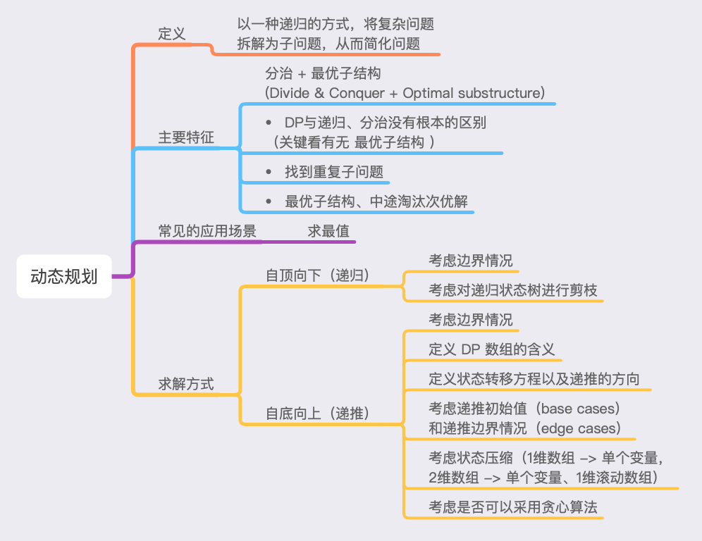

# 第五、六周总结





## 回顾递归

``` python
# Python
def recursion(level, param1, param2, ...):     
	# recursion terminator     
	if level > MAX_LEVEL: 	   
		process_result 	   
		return
		
	# process logic in current level     
	process(level, data...)
	
	# drill down     
	self.recursion(level + 1, p1, ...)
	
	# reverse the current level status if needed
```


## 回顾分治

``` python
# Python
def divide_conquer(problem, param1, param2, ...):   
	# recursion terminator   
	if problem is None: 	
		print_result 	
		return   
		
	# prepare data   
	data = prepare_data(problem)   
	subproblems = split_problem(problem, data)   
	
	# conquer subproblems   
	subresult1 = self.divide_conquer(subproblems[0], p1, ...)   
	subresult2 = self.divide_conquer(subproblems[1], p1, ...)   
	subresult3 = self.divide_conquer(subproblems[2], p1, ...)   
	…  
	
	# process and generate the final result   
	result = process_result(subresult1, subresult2, subresult3, …)	  
	
	# revert the current level states
```


## 感触
- 人肉递归低效、很累、易出错
- 找到最近最简方法，将其拆解成可重复解决的问题
- 数学归纳法思维（抵制人肉递归的诱惑）
- 找重复子问题/状态，可以考虑画状态树


## 动态规划(Dynamic Programming)


### 定义
> 以一种递归的方式，将复杂问题拆解为子问题，从而简化问题


### 主要特征
分治 + 最优子结构 (Divide & Conquer + Optimal substructure)
- DP与递归、分治没有根本的区别（关键看有无 ***最优子结构*** ）
- 找到重复子问题
- 最优子结构、中途淘汰次优解


### 常见的应用场景
- 求最值


### 求解方式

- 自顶向下（递归）
	- 考虑边界情况	
	- 考虑对递归状态树进行剪枝


- 自底向上（递推）
	- 考虑边界情况
	- 定义 DP 数组的含义
	- 定义状态转移方程以及递推的方向
	- 考虑递推初始值（base cases）和递推边界情况（edge cases）
	- 根据递推的方向，考虑状态压缩
		- 单方向移动（如：上、下、左、右）：1维数组 -> 单个变量
		- 多方向移动且不重叠（如：右 & 下）：2维数组 -> 单个变量
		- 多方向移动且重叠（如：右 & 下 & 右下）：2维数组 -> 1维滚动数组 + 临时变量
	- 如果可以简单地利用局部最优解推导出全局最优解，考虑是否可以采用贪心算法


## 实战题目总结


- [最小路径和](https://leetcode-cn.com/problems/minimum-path-sum/)

**DP解法 - 解题思路**
> DP数组的定义：dp[i] 代表 从 0,0 到 i,j 位置的最小路径和；
> base case：第一行从左到右进行累加，第一列从上到下进行累加
> DP 方程：dp[i][j] +=(dp[i - 1][j], dp[i][j - 1]
> 具体步骤：
> 直接将原数组 `grid` 作为 dp 数组（Swift中的数组为值类型而且支持写时复制，不会影响原数组）；
> 先把第一行和第一列的路径和按横向、纵向分别累加起来作为 base case；
> 然后从 1,1 位置开始进行递推，递推方向为左和上，也就是 `dp[i][j]` 的结果由 `dp[i - 1][j]` 和 `dp[i][j - 1]` 二者中的最小值累加获得；
> 最终结果存储在 dp 数组右下角；

``` swift
// Time: O(m * n), Space: O(m * n)
let m = grid.count, n = grid[0].count
var dp = grid
for i in 1..<m { dp[i][0] += dp[i - 1][0] }
for j in 1..<n { dp[0][j] += dp[0][j - 1] }
for i in 1..<m {
    for j in 1..<n {
        dp[i][j] += min(dp[i - 1][j], dp[i][j - 1])
    }
}
return dp[m - 1][n - 1]
```

**DP解法 - 状态压缩**
> DP 的方向：右、下，
> 可以利用滚动数组，将二维 dp 数组压缩为一维；

``` swift
// Time: O(m * n), Space: O(n)
let m = grid.count, n = grid[0].count
var dp = grid[0]
for i in 0..<m {
    for j in 0..<n {
        if j > 0 {
            dp[j] = grid[i][j] + (i > 0 ? min(dp[j], dp[j - 1]) : dp[j - 1])
        } else {
            dp[j] = grid[i][j] + (i > 0 ? dp[j] : 0 )
        }
    }
}
return dp[n - 1]
```


- [最大子序和](https://leetcode-cn.com/problems/maximum-subarray/)

**DP 解法 - 解题思路**

> DP数组的定义：dp[i] 代表 i 位置可获得的最大子序和
> base case：dp[0] = nums[0]
> DP 方程：dp[i] = max(dp[i - 1], 0) + x
> DP 的方向：右
> 具体步骤：
> 遍历数组元素，如果之前累加的和小于0，则从当前元素开始重新累加；
> 每次累加之后，记录最大值，最终返回最后的最大值；
> 
> 状态压缩：状态转移方程只需要用到前一个累加和，所以可以压缩状态到 O(1)；

``` swift
//  Time: O(n), Space: O(n)
func dp1(_ nums: [Int]) -> Int {
    var dp = nums, ans = dp[0]
    for i in 1..<nums.count { // O(n)
        dp[i] = max(dp[i - 1], 0) + nums[i]
        ans = max(ans, dp[i])
    }
    return ans
}

//  Time: O(n), Space: O(1)
func dp2(_ nums: [Int]) -> Int {
    var maxSum = nums[0], ans = maxSum
    for i in 1..<nums.count {
        maxSum = max(maxSum, 0) + nums[i]
        ans = max(ans, maxSum)
    }
    return ans
}
```


**分治解法 - 解题思路**
> 对求解区间进行二分，获得 [l, mid] 和 [mid+1, r] 区间；
> 然后，计算 [l, r] 区间内的：区间和、区间最大子段和、以 l 为左端点的最大子段和、以 r 为右端点的最大子段和；
> 最终，将【区间最大子段和】作为结果返回；

``` swift
// Time: O(n), Space: O(logn)
func divideAndConquer(_ nums: [Int]) -> Int {
    struct Status {
        let lSum: Int // [l,r] 内以 l 为左端点的最大子段和
        let rSum: Int // [l,r] 内以 r 为右端点的最大子段和
        let mSum: Int // [l,r] 内的最大子段和
        let iSum: Int // [l,r] 的区间和
    }
    func pushUp(l: Status, r: Status) -> Status {
        let iSum = l.iSum + r.iSum
        let lSum = max(l.lSum, l.iSum + r.lSum)
        let rSum = max(r.rSum, l.rSum + r.iSum)
        let mSum = max(max(l.mSum, r.mSum), l.rSum + r.lSum)
        return Status(lSum: lSum, rSum: rSum, mSum: mSum, iSum: iSum)
    }
    func get(l: Int, r: Int) -> Status {
        if l == r {
            let x = nums[l]
            return Status(lSum: x, rSum: x, mSum: x, iSum: x)
        }
        let mid = l + (r - l) >> 1
        let ls = get(l: l, r: mid) // O(logn)
        let rs = get(l: mid + 1, r: r) // O(logn)
        return pushUp(l: ls, r: rs)
    }
    return get(l: 0, r: nums.count - 1).mSum 
}
```


- [最长公共子序列](https://leetcode-cn.com/problems/longest-common-subsequence/)

**DP 解法 - 解题思路**
> DP 数组的定义：`dp[i][j]` 代表两个序列最大的公共子序列的值；
> base case：没有公共子序列，dp[i][0], dp[0][j] 都为 0；
> DP 方程：
> 如果字符相同，dp[i][j] = dp[i - 1][j - 1] + 1，否则 dp[i][j] = max(dp[i - 1][j], dp[i][j - 1])
> DP 的方向：右、下、右下
> 具体步骤：
> 开辟一个比字符串长度大 1 的二维数组，递推从索引 1 开始，访问字符串时索引需要减 1；
> 如果字符相同，累加左上角的 dp 值；否则，累加左和上二个方向的 dp 值中的最大值；
> 最终结果存储在 dp[m][n]。

``` swift
// Time: O(m * n), Space: O(mn)
func dp1(_ text1: String, _ text2: String) -> Int {
    let a = Array(text1), b = Array(text2), m = a.count, n = b.count
    // base case: all dp[i][0], dp[0][j] are 0
    var dp = [[Int]](repeating: [Int](repeating: 0, count: n + 1), count: m + 1)
    for i in 1...m { // O(m)
        for j in 1...n { // O(n)
            if a[i - 1] == b[j - 1] {
                dp[i][j] = dp[i - 1][j - 1] + 1
            } else {
                dp[i][j] = max(dp[i - 1][j], dp[i][j - 1])
            }
        }
    }
    return dp[m][n]
}
```


**DP解法 - 状态压缩**
> DP 的方向：右、下、右下，
> 可以利用滚动数组，将二维 dp 数组压缩为一维；
> 由于左和左上的 dp 值会重叠，所以，需要利用临时变量将左上的 dp 值进行缓存；

``` swift
// Time: O(m * n), Space: O(min(m,n))
func dp2(_ text1: String, _ text2: String) -> Int {
    var a = Array(text1), b = Array(text2)
    if a.count > b.count { (a, b) = (b, a) }
    let m = a.count, n = b.count
    var dp = [Int](repeating: 0, count: n + 1)
    for i in 0..<m { // O(m)
        var topLeft = 0
        for j in 1...n { // O(n)
            let preTopLeft = dp[j]
            if a[i] == b[j - 1] {
                dp[j] = topLeft + 1
            } else {
                dp[j] = max(dp[j - 1], dp[j])
            }
            topLeft = preTopLeft
        }
    }
    return dp[n]
}
```


- [解码方法](https://leetcode-cn.com/problems/decode-ways/)

**DP 解法 - 解题思路**

> DP 数组的定义：`f[i]` 代表索引到 i 位置有多少种解码方法；
> base case：f[0] = 1，空字符也有一种解码方式；
> DP 方程：
> 如果当前字符不是 0，f[i] += f[i - 1]，
> 并且如果当前字符的前一个字符也不是0，f[i] += f[i - 2]；
> DP 的方向：右
> 具体步骤：
> 开辟一个比字符串长度大 1 的一维数组，为 base case 赋值，
> 然后，递推从索引 1 开始，访问字符串时索引需要减 1；
> 递推时需要检测 i 是否大于0，否则索引访问可能会越界；
> 最终结果存储在 f[n]。

``` swift
// Time: O(n), Space: O(n)
func dp1(_ s: String) -> Int {
    let n = s.count, s = Array(s)
    var f = [Int](repeating: 0, count: n + 1)
    f[0] = 1 // empty string can be decoded in one way -> empty string
    func isValidLetter(pre: Character, cur: Character) -> Bool {
        let zeroScalar: UInt8 = 48, preScalar = pre.asciiValue!, curScalar = cur.asciiValue!
        return ((preScalar - zeroScalar) * 10 + (curScalar - zeroScalar)) <= 26
    }
    for i in 1...n {
        let cur = s[i - 1]
        if cur != "0" { // use one letter
            f[i] += f[i - 1]
        }
        if i == 1 { continue }
        let pre = s[i - 2] // use two letters
        if pre != "0", isValidLetter(pre: pre, cur: cur) {
            f[i] += f[i - 2]
        }
    }
    return f[n]
}
```


**DP解法 - 状态压缩**
> DP 的方向：右，
> 可以将二维 dp 数组压缩为单个变量；

``` swift
// Time: O(m * n), Space: O(min(m,n))
func dp2(_ text1: String, _ text2: String) -> Int {
    let n = s.count, s = Array(s)
    // a = f[i-2], b = f[i-1], c = f[i]
    var a = 0, b = 1, c = 0
    func isValidLetter(pre: Character, cur: Character) -> Bool {
        let zero = 48 as UInt8
        return ((pre.asciiValue! - zero) * 10 + (cur.asciiValue! - zero)) <= 26
    }
    for i in 1...n {
        c = 0
        if s[i - 1] != "0" {
            c += b
        }
        if i > 1, s[i - 2] != "0", isValidLetter(pre: s[i - 2], cur: s[i - 1]) {
            c += a
        }
        (a, b) = (b, c)
    }
    return c
}
```


