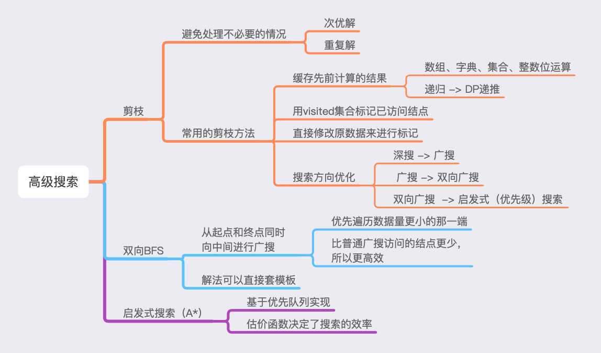

# 第七周总结





## 高级搜索


### 双向 BFS

#### 代码模板

``` swift
var begin = Set([beginNode]), end = Set([endNode]), valid = Set(validNodes)
var counter = 0
while !begin.isEmpty {
    // start searching from a smaller set to get better performance
    if begin.count > end.count { (begin, end) = (end, begin) }
    // search for current level
    var next = Set<Node>()
    for beginNode in begin {
    		let new = findNewNode()
    		if end.contains(new) { return counter + 1 }
    		// avoid cycles
        if !valid.contains(new) { continue }
        valid.remove(new)
        // add to next search
        next.insert(new)
    }
    // go to next level
    begin = next
    counter += 1
}
return 0 // no valid results
```


## 实战题目总结


- [有效的数独](https://leetcode-cn.com/problems/valid-sudoku/)


> 数组 解法 - 解题思路：
1. 构建3个二维数组，用来检测行、列、3*3小格子中的数是否重复；
2. 遍历数独矩阵，如果是 . 字符就继续遍历下一个位置；
3. 取出数字，转换为数组索引（注意减 1，否则索引越界 crash）；
4. 转换索引时，格子索引的计算公式为： row/3, column/3；
4. 分别对当前位置的行、列、3*3格子的计数器加 1；
5. 如果行、列、格子中的任何一个计数器超过1，说明该数独矩阵无效；

``` swift
// Time: O(1), Space: O(1), row == column == 9
func hashWithIndiceArray(_ board: [[Character]]) -> Bool {
    let n = 9, nums = [Int](repeating: 0, count: n)
    let zero = Character("0").asciiValue!
    var rows = [[Int]](repeating: nums, count: n),
        cols = rows,
        subboxes = [[[Int]]](repeating: [[Int]](repeating: nums, count: 3), count: 3)
    for row in 0..<9 {
        for col in 0..<9 {
            let c = board[row][col]
            if c == "." { continue }
            let i = Int(c.asciiValue! - zero - 1) // numbers are greater than 0
            rows[row][i] += 1
            cols[i][col] += 1
            subboxes[row/3][col/3][i] += 1
            if rows[row][i] > 1
                || cols[i][col] > 1
                || subboxes[row/3][col/3][i] > 1 {
                return false
            }
        }
    }
    return true
}
```


> 位运算 解法 - 解题思路：
1. 首先，整体思路与数组解法相同，主要是利用位运算对数组的空间进行压缩；
2. 其次，需要掌握位运算操作的技巧：
3. ((value >> index) & 1) == 1，可以检测 index 指向的二进制位是否为 1；
4. list[pos] |= (1 << index)，可以将 index  指向的二进制位置为 1；

``` swift
// Time: O(1), Space: O(1), row == column == 9
func bitsWithIndice(_ board: [[Character]]) -> Bool {
    let n = 9, nums = [Int](repeating: 0, count: n)
    let zero = Character("0").asciiValue!
    var rows = nums, cols = nums, subboxes = nums // 9 boxes
    func used(_ value: Int, index: Int) -> Bool {
        ((value >> index) & 1) == 1
    }
    func save(_ index: Int, at pos: Int, in list: inout [Int]) {
        list[pos] |= (1 << index)
    }
    for row in 0..<n {
        for col in 0..<n {
            let c = board[row][col]
            if c == "." { continue }
            let i = Int(c.asciiValue! - zero)
            if used(rows[row], index: i)
                || used(cols[col], index: i)
                || used(subboxes[row/3*3 + col/3], index: i) {
                return false
            }
            save(i, at: row, in: &rows)
            save(i, at: col, in: &cols)
            save(i, at: row/3*3 + col/3, in: &subboxes)
        }
    }
    return true
}
```


- [N皇后](https://leetcode-cn.com/problems/n-queens/)


> 基于集合的回溯解法 - 解题思路：
1. 构建 3 个集合用于存储列、两条对角线上已经放置的皇后的位置；
2. 构建 queens 数组，用于记录所有皇后在每一行的位置，最终用于输出棋盘；
3. 利用 row - col 和 row + col 等于某个常数这一规律，高效地检测对角线是否已存在其他皇后；
4. 剩下的工作就是套用回溯算法的模板；

``` swift
// Time: O(n!), Space: O(n)
func backtrackWithSet(_ n: Int) -> [[String]] {
    var cols = Set<Int>(), diagonals1 = cols, diagonals2 = cols
    var ans = [[String]](), queens = [Int](repeating: -1, count: n)
    let rawBoardRow = [Character](repeating: ".", count: n)
    func makeBoard() -> [String] {
        var board = [String]()
        for i in 0..<n {
            var row = rawBoardRow
            row[queens[i]] = "Q"
            board.append(String(row))
        }
        return board
    }
    func backtrack(row: Int) {
        if row == n {
            ans.append(makeBoard())
            return
        }
        for col in 0..<n {
            if cols.contains(col) { continue }
            let d1 = row - col
            if diagonals1.contains(d1) { continue }
            let d2 = row + col
            if diagonals2.contains(d2) { continue }
            queens[row] = col
            cols.insert(col)
            diagonals1.insert(d1)
            diagonals2.insert(d2)
            backtrack(row: row + 1)
            queens[row] = -1
            cols.remove(col)
            diagonals1.remove(d1)
            diagonals2.remove(d2)
        }
    }
    backtrack(row: 0)
    return ans
}
```


> 基于位运算的回溯解法 - 解题思路：
> 首先，整体思路与基于结合的解法相同，主要是利用位运算压缩空间；
> 其次，随着遍历行号增加，对角线上的二进制位需要左移、右移；
> 最后，需要掌握位运算的技巧：
> 1. x & (−x) 可以获得 x 的二进制表示中的最低位的 1 的位置；
> 2. x & (x−1) 可以将 x 的二进制表示中的最低位的 1 置成 0；
> 3. ((1 << n) - 1) & (~(cols | d1 | d2)) 可以高效地获取未占用的二进制；

``` swift
// Time: O(n!), Space: O(n)
func backtrackWithBitOperation(_ n: Int) -> [[String]] {
    var queens = [Int](repeating: -1, count: n), ans = [[String]]()
    let rawBoardRow = [Character](repeating: ".", count: n)
    func makeBoard() -> [String] {
        var board = [String]()
        for i in 0..<n {
            var row = rawBoardRow
            row[queens[i]] = "Q"
            board.append(String(row))
        }
        return board
    }
    func bitCount(_ x: Int) -> Int {
        var x = x, count = 0
        while x > 0 {
            x &= (x - 1)
            count += 1
        }
        return count
    }
    func backtrack(row: Int, cols: Int, diagonals1: Int, diagonals2: Int) {
        if row == n {
            ans.append(makeBoard())
            return
        }
        let d1 = diagonals1, d2 = diagonals2
        var validPos = ((1 << n) - 1) & (~(cols | d1 | d2))
        while validPos != 0 {
            let pos = validPos & (-validPos)
            validPos &= (validPos - 1)
            let col = bitCount(pos - 1)
            queens[row] = col
            backtrack(row: row + 1,
                      cols: cols | pos,
                      diagonals1: (d1 | pos) << 1,
                      diagonals2: (d2 | pos) >> 1)
            queens[row] = -1
        }
    }
    backtrack(row: 0, cols: 0, diagonals1: 0, diagonals2: 0)
    return ans
}
```


- [最小基因变化](https://leetcode-cn.com/problems/minimum-genetic-mutation/)


> DFS解法 - 解题思路：
> 如果开始字符串等于结束字符串，就将当前的修改次数与全局的修改次数进行比较，取最小值。（因为DFS需要在搜索完所有可行解之后，才知道哪一个是最优解）
> 否则，遍历有效结果集合中的字符串，逐个统计有效结果和开始字符串的字符差异数量，如果有效结果字符串和开始字符串的差异为1，而且该字符串不在已访问集合中，就将该字符串作为下一次搜索的开始字符串，然后将修改次数加1后传入下一次搜索。

``` swift
// Time: O(m * n), Space: O(n)
// n 是基因字符串长度，m 是 bank 的长度
func minMutationWithDFS(_ start: String, _ end: String, _ bank: [String]) -> Int {
    if start == end { return 0 }
    if !bank.contains(end) { return -1 }
    var mutations: Int?, valid = Set(bank), visited = Set<String>()
    func dfs(s: String, e: String, m: Int) {
        if s == e {
            mutations = min(mutations ?? .max, m)
            return
        }
        for v in valid { // O(m)
            var diff = 0
            for (a, b) in zip(v, s) { // O(n)
                if a != b { diff += 1 }
                if diff > 1 { break }
            }
            if diff == 1, !visited.contains(v) {
                visited.insert(v)
                defer { visited.remove(v) }
                dfs(s: v, e: e, m: m + 1)
            }
        }
    }
    dfs(s: start, e: end, m: 0)
    return mutations ?? -1
}
```


> 双向BFS 解法 - 解题思路：
1. 判定特殊情况，如果 start == end 或者 bank 不包含 end，直接返回结果；
2. 基于 start 和 end 字符串分别构建 from 和 to 两个集合，将 bank 数组存入集合中，提高查找效率；
2. 循环开始时，比较 from 和 to 集合的数据量，将数据量小的集合作为 from，然后从 from 开始搜索；
3. 搜索的过程中尝试替换字符，并检测字符串。如果重复，跳过；如果查找完成，返回结果；如果有效就存入下一次搜索的集合中；
4. 如果循环正常退出，说明没有解；

``` swift
// Time: O(n * k * m), Space: O(n)
// n 是基因字符串长度，k 是 4（A,C,G,T），m 是 bank 的长度
func minMutationWithBidirectionalBFS(_ start: String, _ end: String, _ bank: [String]) -> Int {
    if start == end { return 0 }
    if !bank.contains(end) { return -1 }
    let choices: [Character] = ["A", "C", "G", "T"]
    var from = Set([start]), to = Set([end]), valid = Set(bank), ans = 0
    while !from.isEmpty {
        if from.count > to.count {
            (from, to) = (to, from) // bidirectional BFS reduces paths
        }
        var next = Set<String>()
        for f in from { // O(m)
            let fromChars = Array(f)
            for i in 0..<f.count { // O(n)
                for choice in choices { // O(k)
                    if fromChars[i] == choice { continue } // skip same
                    var temp = fromChars
                    temp[i] = choice
                    let new = String(temp)
                    if to.contains(new) { return ans + 1 } // find it!
                    if !valid.contains(new) { continue }
                    valid.remove(new) // avoid cycle
                    next.insert(new)
                }
            }
        }
        ans += 1
        from = next
    }
    return -1 // no matches
}
```


- [单词接龙](https://leetcode-cn.com/problems/word-ladder/description/)


> 双向BFS 解法 - 解题思路：
> 其实，这个题和【最小基因变化变化】差不多，主要的差异：
> 1. 变化的字符从 A, C, G, T 增加到了 26 个小写字母；
> 2. 最终的结果需要加 1（算上开始的单词）；
> 除此之外，基本上就是套用双向BFS模板。

``` swift
// Time: O(n * c * k), Space: O(n)
// n 是单词列表长度，c 是单词字符数，k 是26个字母的长度
func bidirectionalBFS(_ start: String, _ end: String, _ bank: [String]) -> Int {
    if !wordList.contains(endWord) { return 0 }
    let letters = (0..<26).map { Character(UnicodeScalar($0 + 97)) }
    var begin = Set([beginWord]), end = Set([endWord])
    var valid = Set(wordList), ans = 1 // should count the begin word
    while !begin.isEmpty {
        if begin.count > end.count {
            (begin, end) = (end, begin) // bidirectional BFS reduces set size
        }
        var next = Set<String>()
        for b in begin {
            let beginChars = Array(b)
            for i in 0..<b.count {
                for letter in letters {
                    if beginChars[i] == letter { continue }
                    var temp = beginChars
                    temp[i] = letter
                    let new = String(temp)
                    if end.contains(new) { return ans + 1 }
                    if !valid.contains(new) { continue }
                    valid.remove(new) // avoid cycle
                    next.insert(new)
                }
            }
        }
        ans += 1
        begin = next
    }
    return 0 // no result
}
```


- [单词搜索 II](https://leetcode-cn.com/problems/word-search-ii/)


> 基于字典树(Trie)的回溯解法 - 解题思路：
1. 遍历单词，构建字典树并将单词存入字典树中，后面的回溯需要用到单词字符串；
2. 遍历矩阵，从字典树的根开始匹配，如果不满足就检测下一个位置；
3. 回溯时，先检测当前的字典树节点是否存有单词，如果有，则放入最终结果中并移除该单词；
4. 然后将当前的搜索位置置为无效字符，以标记为已访问；
5. 然后开始进行常规的四连通DFS；
6. DFS结束后，将当前的搜索位置恢复为原来的字符（回溯）；
7. 最后，如果当前字典树节点没有子节点，则将当前字典树节点从父节点移除以剪枝；

``` swift
// Time: O(M*4*(3^(L-1))), M: 矩阵的格子数量, L: 单词长度
// Space: O(n), 单词数量
func findWordsWithTrie(_ board: [[Character]], _ words: [String]) -> [String] {
    final class TrieNode {
        var word = "", children = [Character: TrieNode]()
    }
    let root = TrieNode(), Row = board.count, Col = board[0].count
    for word in words {
        var node = root
        for c in word {
            if let n = node.children[c] { node = n }
            else {
                let new = TrieNode()
                node.children[c] = new
                node = new
            }
        }
        node.word = word
    }
    let drow = [-1, 0, 1, 0], dcol = [0, 1, 0, -1]
    var board = board, ans = [String]()
    func backtrack(row: Int, col: Int, parent: TrieNode) {
        let letter = board[row][col], curNode = parent.children[letter]!
        // find a word
        if !curNode.word.isEmpty {
            ans.append(curNode.word)
            curNode.word = ""
        }
        // dfs
        board[row][col] = "#"
        for i in 0..<drow.count {
            let r = row + drow[i], c = col + dcol[i]
            if r < 0 || c < 0 || r >= Row || c >= Col { continue }
            if curNode.children[board[r][c]] == nil { continue }
            backtrack(row: r, col: c, parent: curNode)
        }
        board[row][col] = letter
        // remove leaf nodes
        if curNode.children.isEmpty {
            parent.children[letter] = nil
        }
    }
    for r in 0..<Row {
        for c in 0..<Col {
            if root.children[board[r][c]] == nil { continue }
            backtrack(row: r, col: c, parent: root)
        }
    }
    return ans
}
```


- [ 二进制矩阵中的最短路径](https://leetcode-cn.com/problems/shortest-path-in-binary-matrix/)


> A* 解法 - 解题思路：
1. 考虑特殊情况，提前退出。如：左上角、右下角的值为 1；矩阵只有一个 1；
2. 构建优先队列，队列中的节点需要记录行、列、到终点的曼哈顿距离、当前的步数；
3. 估价函数需要先比较节点的步数，步数少的节点排在前面；如果步数相同，曼哈顿距离更小的节点排在前面；
4. 遍历时，每次取出优先队列队首的元素，对其进行八连通的遍历。如果相邻节点可以扩散，则将其对应的矩阵位置设置为1以标记为已访问，然后将其行、列、曼哈顿距离、当前步数+1加入优先队列中；

``` swift
// Time: O(n*n), Space: O(n*n)
func AStarSearch3(_ grid: [[Int]]) -> Int {
    let n = grid.count
    if grid[0][0] == 1 || grid[n - 1][n - 1] == 1 { return -1 }
    if n == 1 { return 1 }
    let drow = [-1,0,1,0,-1,-1,1,1], dcol = [0,1,0,-1,-1,1,-1,1]
    let start = (row: 0, col: 0, distance: 0, step: 1)
    var pq = PriorityQueue<(row: Int, col: Int, distance: Int, step: Int)>(
        capacity: n * n, defaultValue: start, sort: { a, b in
            if a.step != b.step { return a.step < b.step }
            return a.distance < b.distance
        }
    )
    pq.insert(start)
    var grid = grid
    while !pq.isEmpty {
        let coord = pq.pop()
        let row = coord.row, col = coord.col
        if row == n - 1, col == n - 1 { return coord.step }
        for j in 0..<drow.count {
            let r = row + drow[j], c = col + dcol[j]
            if r < 0 || c < 0 || r >= n || c >= n || grid[r][c] != 0 { continue }
            grid[r][c] = 1
            pq.insert((r, c, abs(r - n) + abs(c - n), coord.step + 1))
        }
    }
    return -1
}
```


