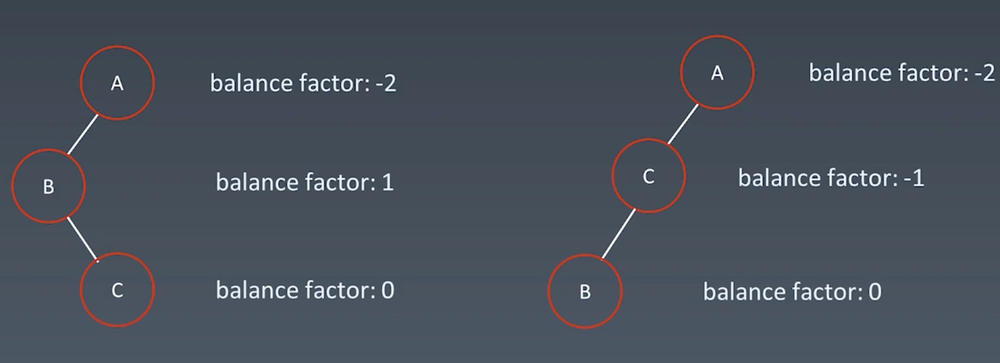
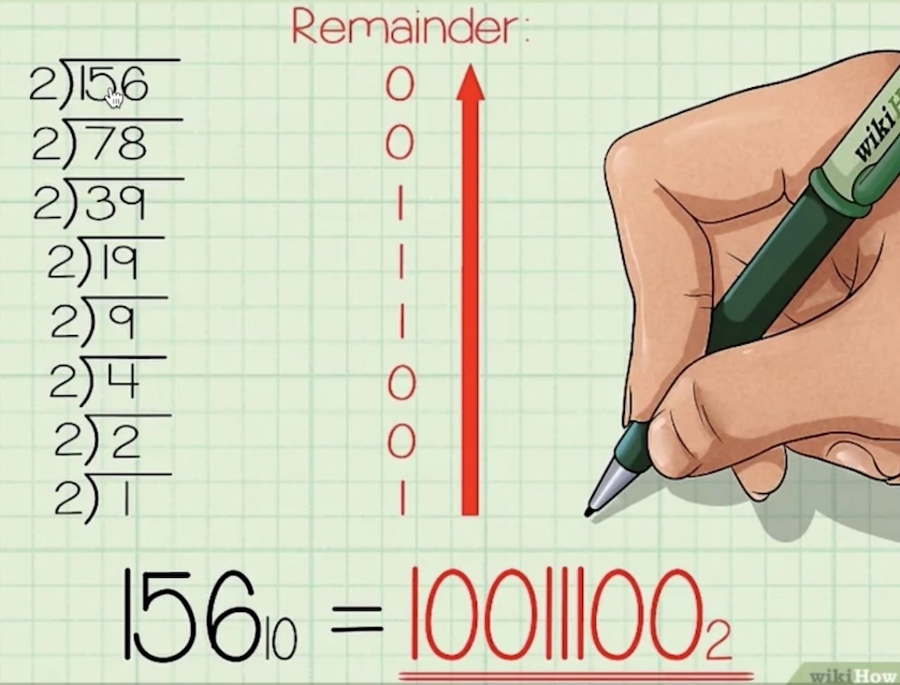

# 第八周总结


## 字典树

``` swift
final class TrieNode {
    var isWord = false, children = [Character: TrieNode]()
}

final class Trie {
    private let root = TrieNode()

    func insert(_ word: String) {
        var node = root
        for c in word {
            if let n = node.children[c] {
                node = n
            } else {
                let new = TrieNode()
                node.children[c] = new
                node = new
            }
        }
        node.isWord = true
    }

    func search(_ word: String) -> Bool { find(word)?.isWord ?? false }

    func startsWith(_ prefix: String) -> Bool { find(prefix) != nil }

    private func find(_ s: String) -> TrieNode? {
        var node = root
        for c in s {
            if let n = node.children[c] {
                node = n
            } else {
                return nil
            }
        }
        return node
    }
}
```


## 并查集

``` swift
struct UnionFind {
    private(set) var count: Int
    private var parent: [Int]
    private var size: [Int]
    
    init(n: Int) {
        count = n
        parent = [Int](repeating: 0, count: n)
        size = parent // 结点的初始重量为 0
        for i in 0..<n { parent[i] = i } // 默认指向自身，所有的结点互不连通
    }
    
    mutating func unite(_ p: Int, _ q: Int) {
        let a = parent(p), b = parent(q)
        if a == b { return }
        if size[a] > size[b] { // 平衡优化，小树接到大树上
            parent[b] = a
            size[a] += size[b]
        } else {
            parent[a] = b
            size[b] += size[a]
        }
        count -= 1
    }
    
    mutating func isConnected(_ p: Int, _ q: Int) -> Bool {
        parent(p) == parent(q)
    }
    
    private mutating func parent(_ x: Int) -> Int {
        var x = x
        while parent[x] != x {
            parent[x] = parent[parent[x]] // 压缩路径，将叶子结点接到根节点
            x = parent[x]
        }
        return x
    }
}
```


## AVL树和红黑树


### AVL 树


#### 旋转操作

- 左旋


- 右旋


- 左右旋



- 右左旋
参考左右旋

- 旋转子树


### 红黑树


## 位运算


### 十进制转二进制




### 常用的位运算操作


## 实战题目总结


- [problem](link)


> ? 解法 - 解题思路：


``` swift
// Time: O(?), Space: O(?)

```


- [problem](link)


> ? 解法 - 解题思路：


``` swift
// Time: O(?), Space: O(?)

```