# 第九周总结


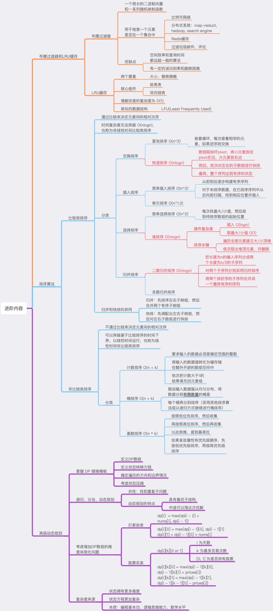


## 布隆过滤器和LRU缓存


### 布隆过滤器 (Bloom Filter)

* 布隆过滤器的原理和哈希表类似
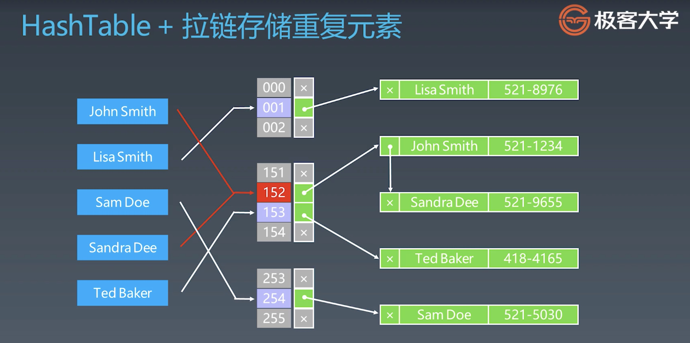

* 布隆过滤器可以高效地验证元素是否存在于集合中
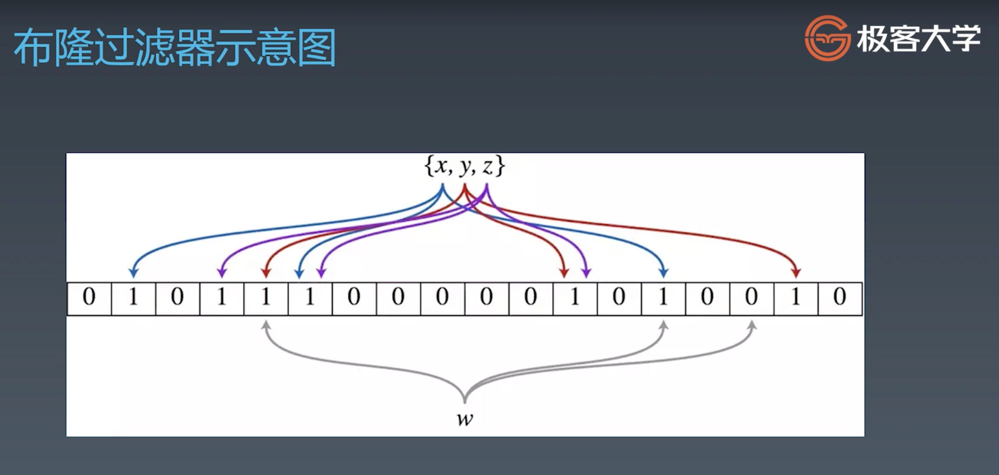

* 可以完全确定元素不在集合中，但是不能确定元素在集合中
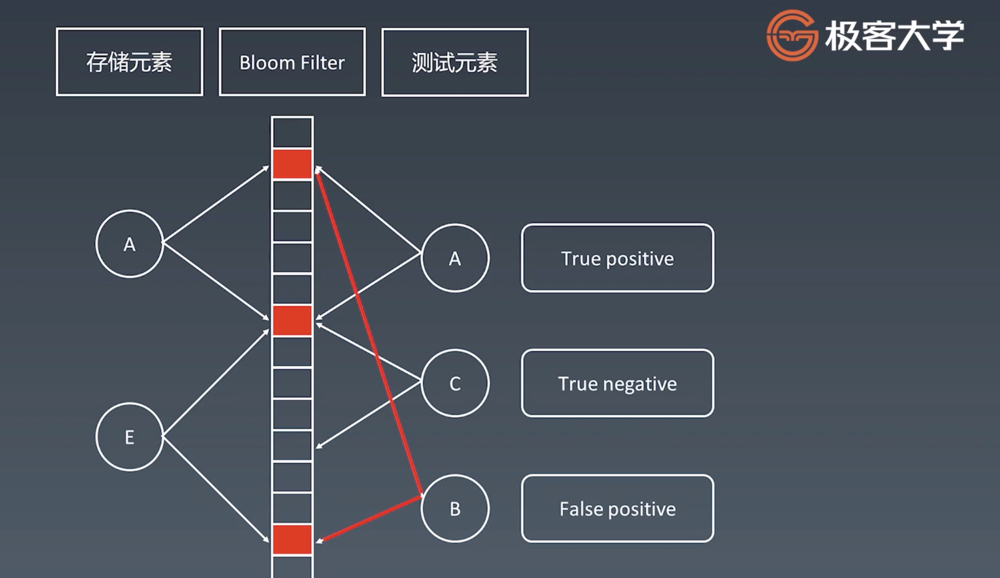

* 实现代码参考
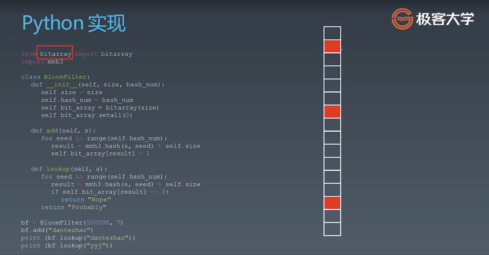


### LRU 缓存

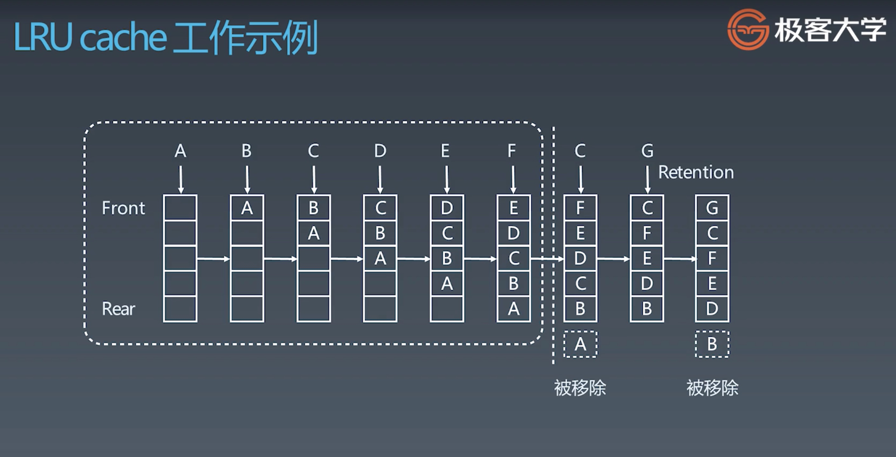


## 排序算法

### 排序算法分类
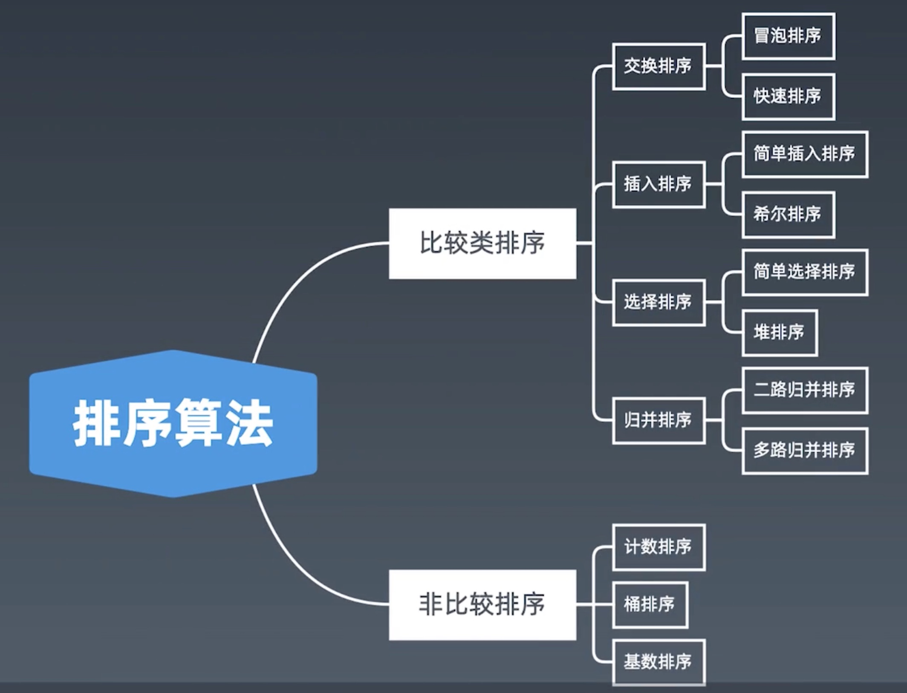

### 复杂度及稳定性
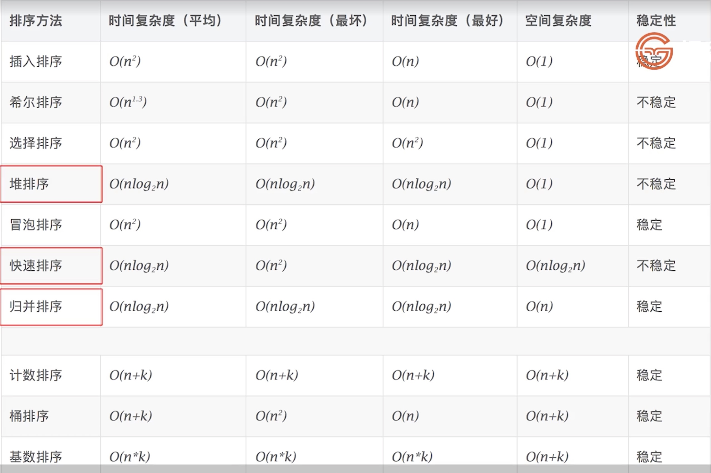


### 代码示例

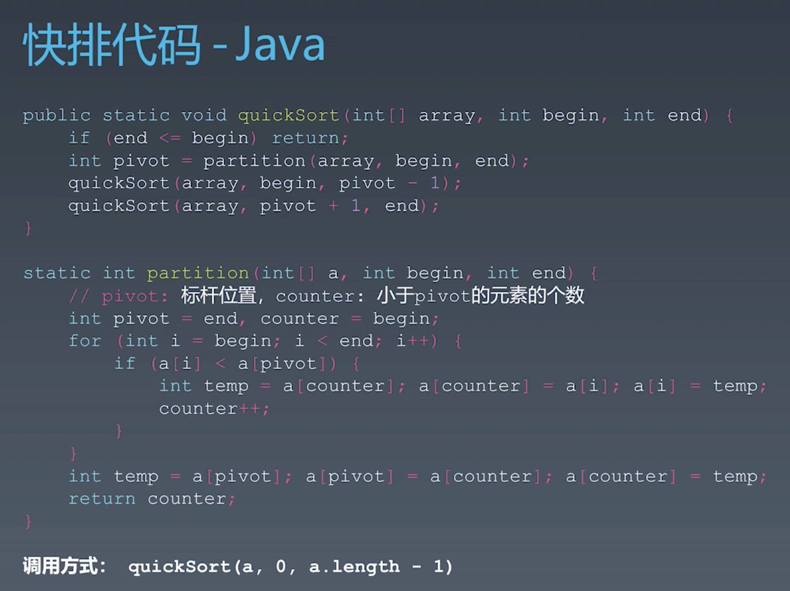

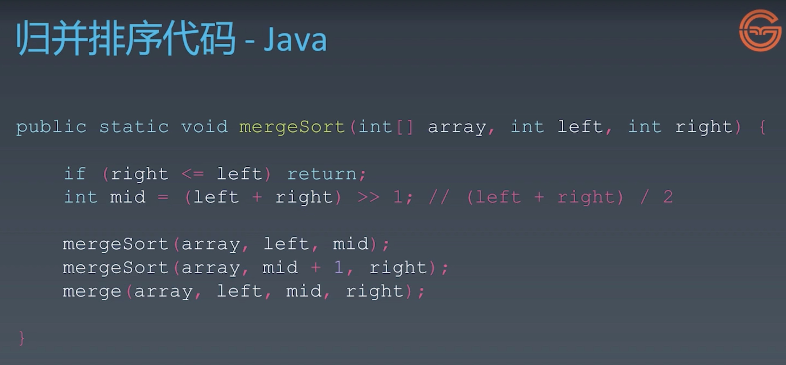
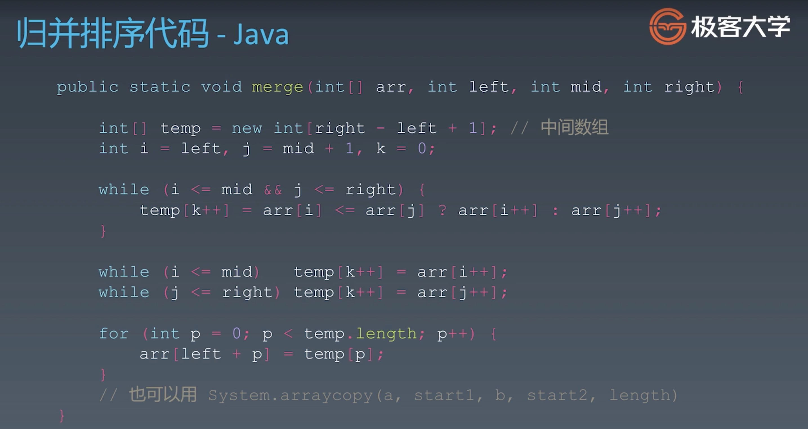

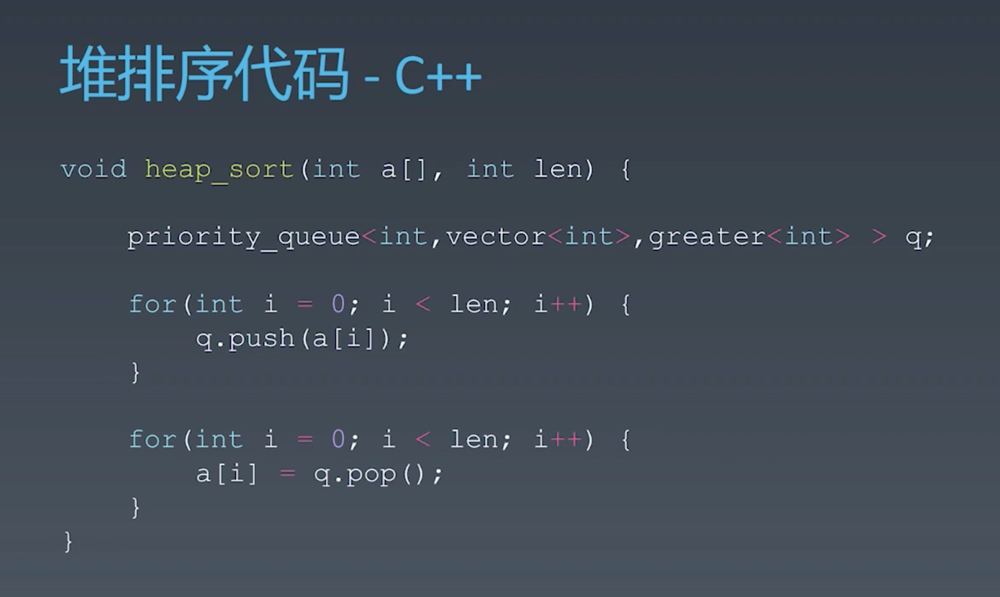
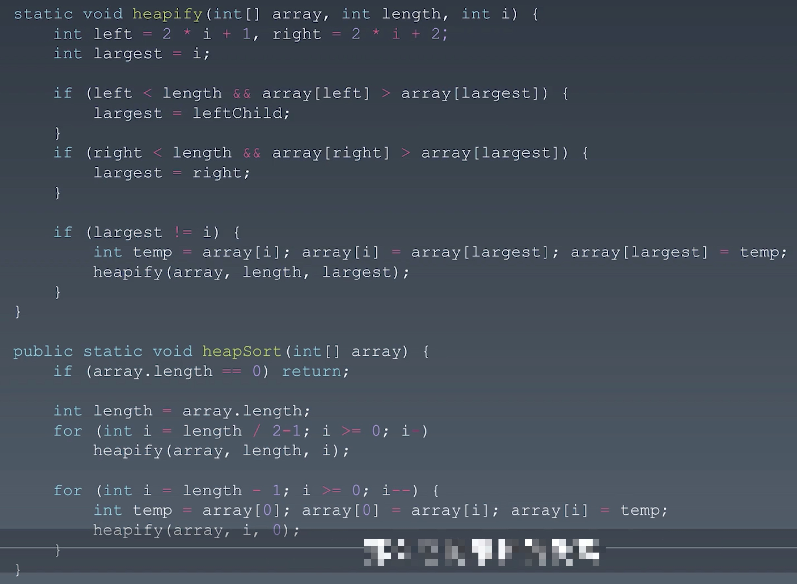


### 各种初级排序算法

* 冒泡排序
``` swift
func bubbleSort(_ nums: inout [Int]) {
    let n = nums.count
    for i in 0..<n {
        for j in stride(from: 1, to: n - i, by: 1) {
            if nums[j] >= nums[j - 1] { continue }
            nums.swapAt(j, j - 1)
        }
    }
}
```

* 插入排序
``` swift
func insertSort(_ nums: inout [Int]) {
    let n = nums.count
    for i in 1..<n {
        let temp = nums[i]
        for j in (0..<i).reversed() {
            if nums[j] > temp { nums.swapAt(j, j + 1) }
        }
    }
}
```

* 选择排序
``` swift
func selectSort(_ nums: inout [Int]) {
    let n = nums.count
    for i in 0..<n {
        var minIndex = i
        for j in stride(from: i + 1, to: n - 1, by: 1) {
            if nums[j] < nums[minIndex] { minIndex = j }
        }
        nums.swapAt(i, minIndex)
    }
}
```


参考资料：[十大经典排序算法](https://www.runoob.com/w3cnote/ten-sorting-algorithm.html)


## 高级动态规划

### 递推模板

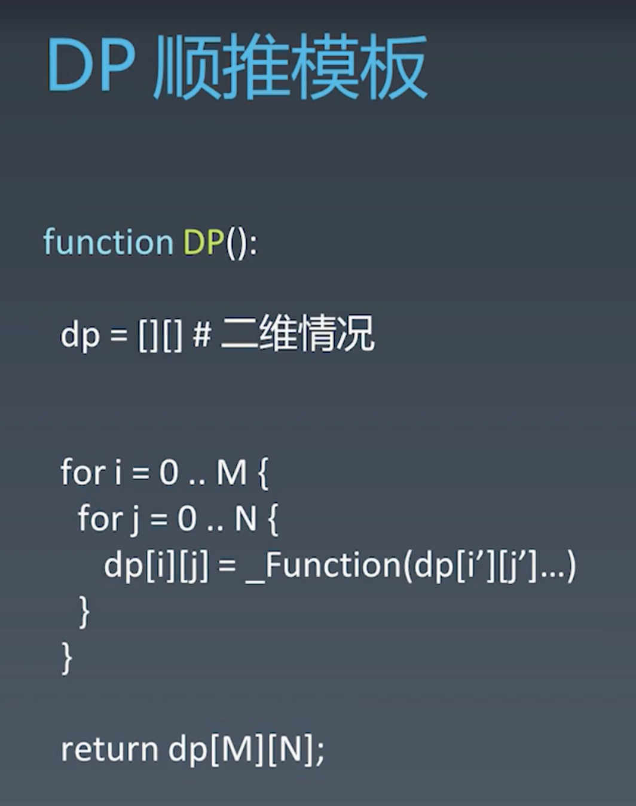

### 通过增加DP数组的维度来解决问题

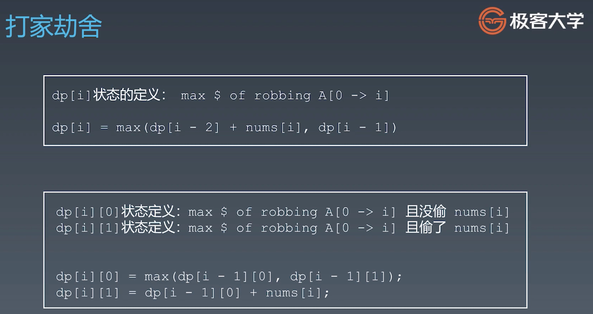

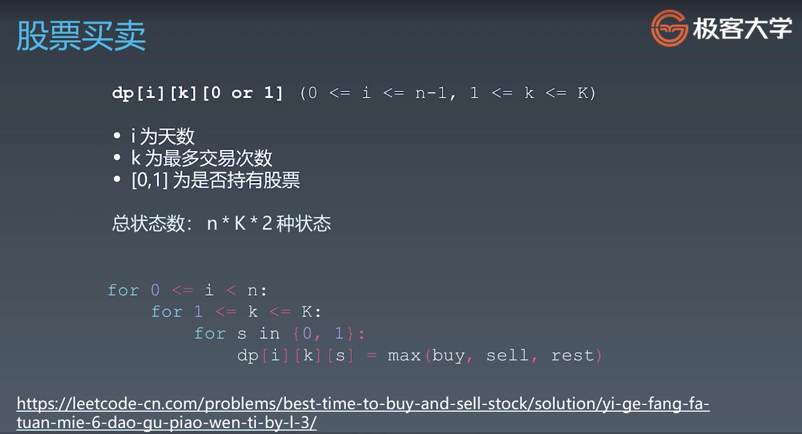
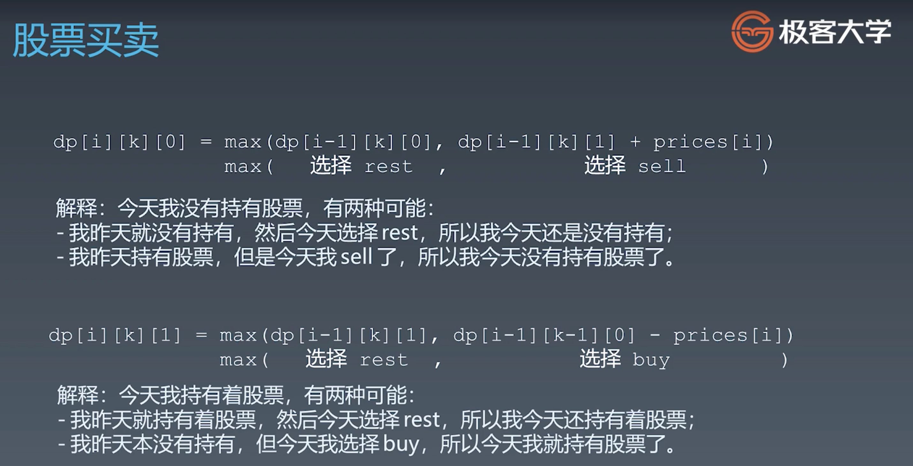
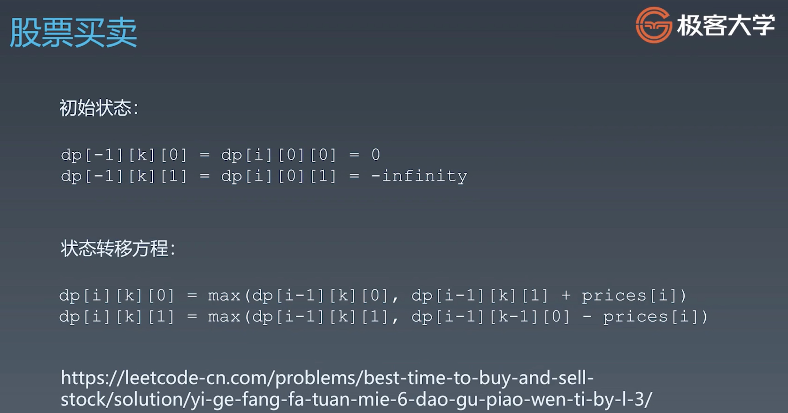

### [不同路径2](https://leetcode-cn.com/problems/unique-paths-ii/) 的状态转移方程

``` swift
dp[i][j] = grid[i][j] == 1 ? 0 : dp[i - 1][j] + dp[i][j - 1]
```


## 实战题目总结


- [LRU缓存机制](https://leetcode-cn.com/problems/lru-cache/)


> 解题思路：
> 首先，构建一个字典用于存储值和结点之间的映射关系，基于双向链表构建头、尾结点并指向彼此；
> 插入时，如果值对应的结点已存在，则将结点移到最前；否则，创建新结点，并检查LRU当前的容量，如果容量不足则删除最后的结点和对应的字典里面的值，然后将新结点存储到最前，并在字典中记录该值；
> 获取时，如果值存在，就将该值对应的结点移到最前，并返回该值；否则，返回 notFound；

``` swift
// Time: O(1), Space: O(n)
class LRUCache {
    final class Node {
        var key: Int
        var value: Int
        var prev: Node?
        var next: Node?
        init(key: Int, value: Int) {
            self.key = key
            self.value = value
        }
    }

    static let notFound = -1

    private var dict: [Int: Node]
    private let capacity: Int

    private let head = Node(key: 0, value: 0)
    private let tail = Node(key: 0, value: 0)

    init(_ capacity: Int) {
        self.capacity = capacity
        dict = [Int: Node](minimumCapacity: capacity)
        head.next = tail
        tail.prev = head
    }

    func get(_ key: Int) -> Int {
        if let node = dict[key] {
            moveNodeToHead(node)
            return node.value
        }
        return LRUCache.notFound
    }

    func put(_ key: Int, _ value: Int) {
        if let node = dict[key] {
            node.value = value
            moveNodeToHead(node)
        } else {
            if dict.keys.count >= capacity {
                let last = removeTail()
                dict[last.key] = nil
            }
            let node = Node(key: key, value: value)
            dict[key] = node
            addNodeToHead(node)
        }
    }

    private func addNodeToHead(_ node: Node) {
        head.next?.prev = node
        node.next = head.next
        node.prev = head
        head.next = node
    }
    private func removeNode(_ node: Node) {
        let pre = node.prev
        let next = node.next
        pre?.next = next
        next?.prev = pre
    }
    private func moveNodeToHead(_ node: Node) {
        removeNode(node)
        addNodeToHead(node)
    }
    private func removeTail() -> Node {
        let last = tail.prev!
        tail.prev = last.prev
        last.prev?.next = tail
        return last
    }
}
```


- [problem](link)


> ? 解法 - 解题思路：


``` swift
// Time: O(?), Space: O(?)

```


- [problem](link)


> ? 解法 - 解题思路：


``` swift
// Time: O(?), Space: O(?)

```