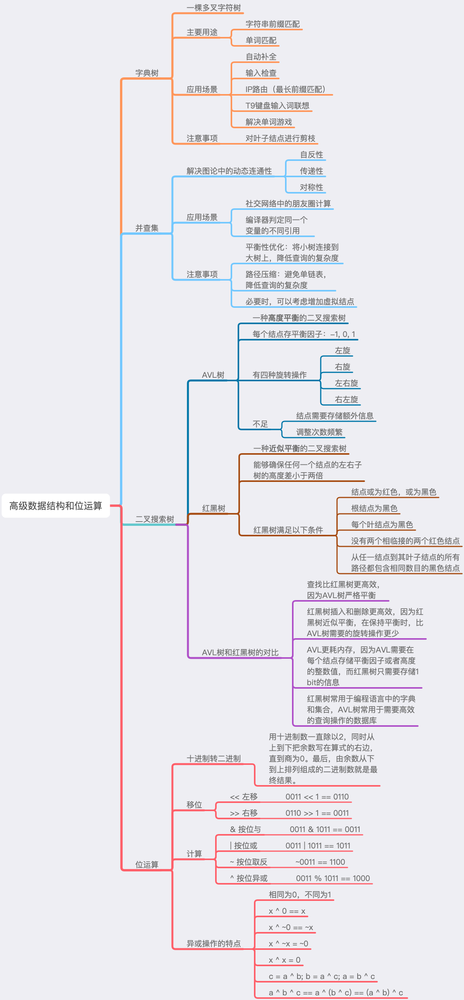
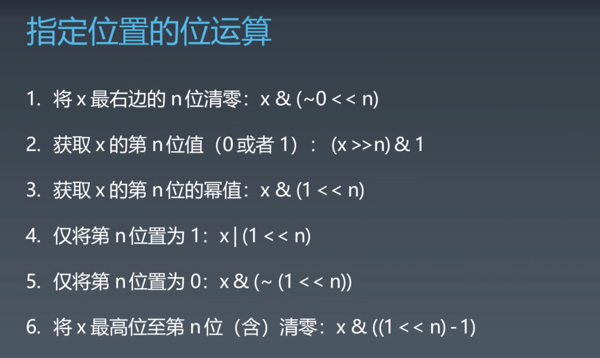
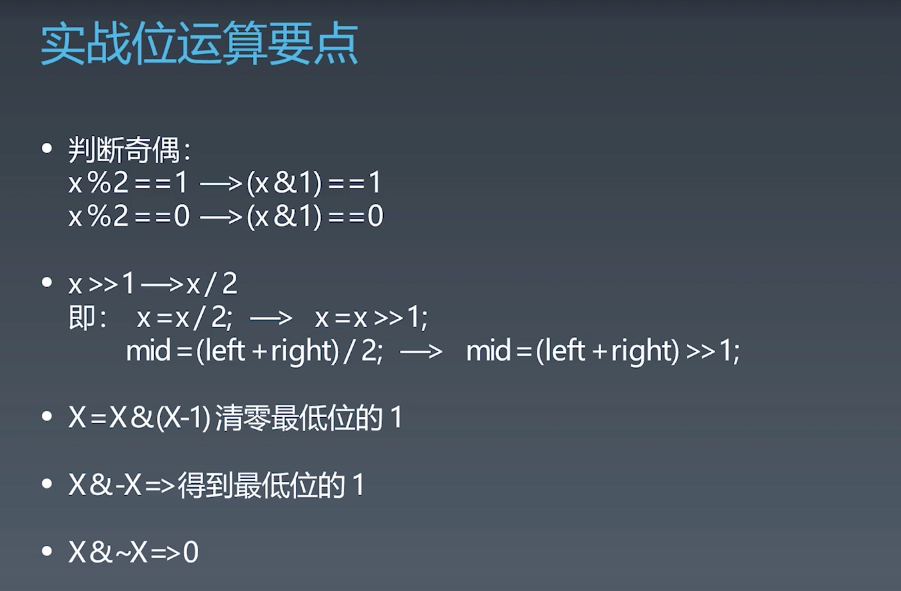

# 第八周总结





## 位运算






## 实战题目总结


- [problem](link)


> ? 解法 - 解题思路：


``` swift
// Time: O(?), Space: O(?)

```


- [problem](link)


> ? 解法 - 解题思路：


``` swift
// Time: O(?), Space: O(?)

```